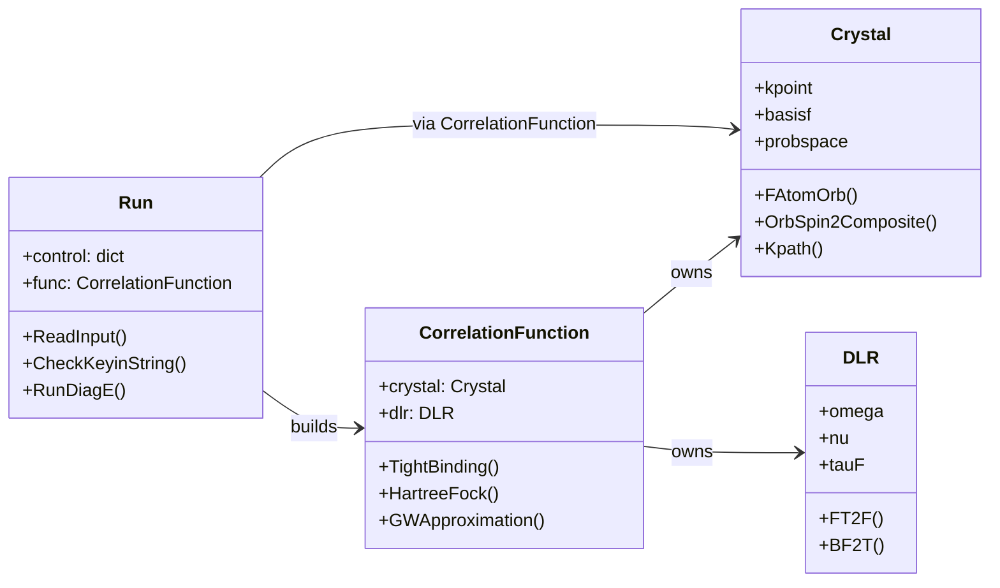
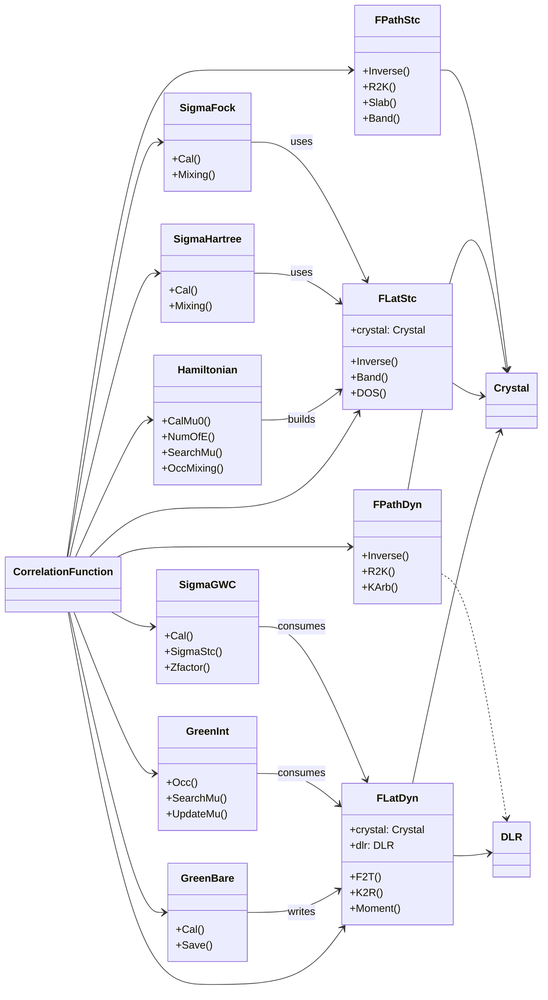
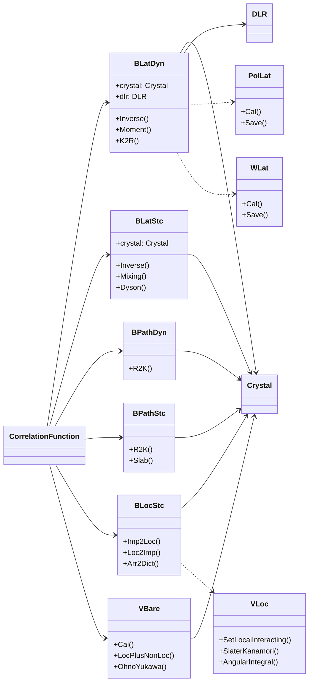
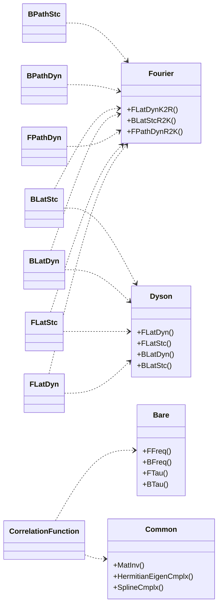

# Serial Class Diagram

The following diagrams capture the main classes and composition relationships in the serial pipeline (`src/QuantumAssemble.py` and `src/QAssemble/Serial`). Solid arrows point from an owner to the component it instantiates or calls directly. Dashed arrows highlight helper utilities that are passed in or referenced for numerical work.

## High-Level Flow

## Fermionic Stack

## Bosonic Stack

## Shared Utilities

Use the diagrams alongside `docs/SerialModules.md` for deeper descriptions of each class and the numerical responsibilities they own.
