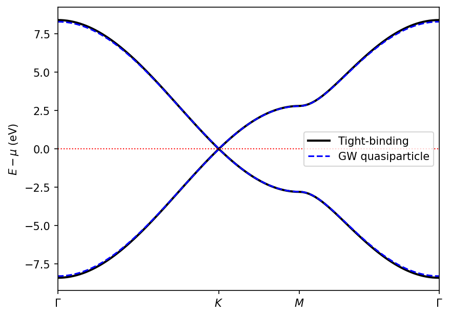
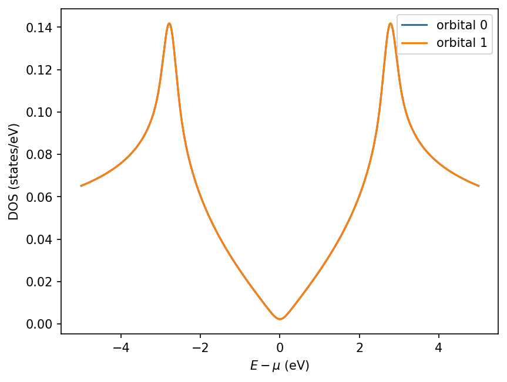
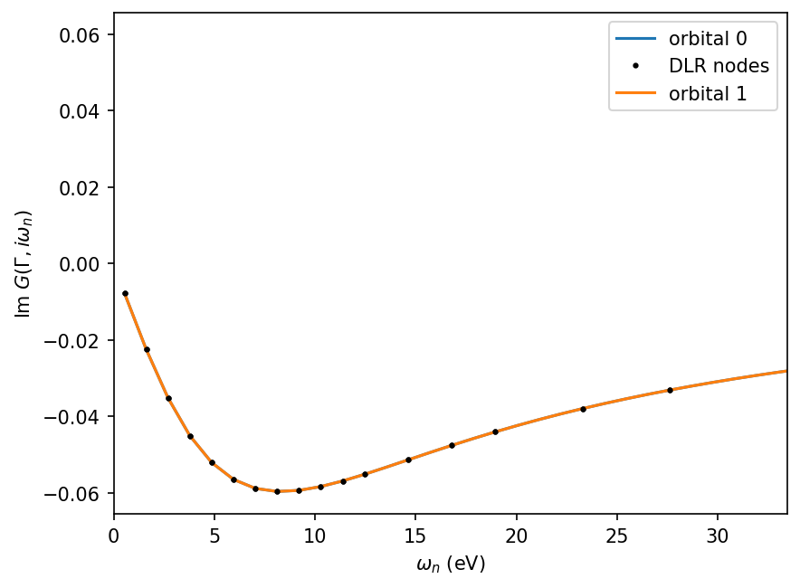

# Tutorial: GW for Graphene, Start to Finish

This tutorial follows one complete calculation — the extended-Hubbard model of
graphene solved in the GW approximation — from problem formulation through
input construction, execution, HDF5 output inspection, post-processing, and
physical interpretation. All files are in
[`examples/graphene/`](https://github.com/QAssemble/qassemble/tree/main/examples/graphene)
of the repository, and the whole workflow is two commands:

```bash
cd examples/graphene
qassemble            # ~30 s serial
python analyze.py    # band structure, DOS, Matsubara Green's function
```

## 1. The model

Graphene is described by a two-site honeycomb lattice with one orbital per
carbon sublattice. The Hamiltonian is the extended Hubbard model

$$
H = -t \sum_{\langle ij \rangle \sigma} c^\dagger_{i\sigma} c_{j\sigma}
  + U \sum_i n_{i\uparrow} n_{i\downarrow}
  + V \sum_{\langle ij \rangle} n_i n_j ,
$$

with nearest-neighbour hopping $t = 2.8$ eV, on-site interaction
$U = 2.0$ eV, and nearest-neighbour interaction $V = 0.2$ eV, at half
filling. See the [Hamiltonian](../theory/hamiltonian.md) and
[GW approximation](../theory/gw-approximation.md) theory pages for the
formalism.

## 2. The input file

`examples/graphene/qassemble.in` is a single declarative dictionary with
three sections. The parser accepts only literal data — no code is executed
(see the [quick start](../getting-started/quickstart.md) for the format
rules).

**`Crystal`** defines the geometry and electron count:

```python
"Crystal": {
    "RVec": [[1, 0, 0], [0.5, 0.866, 0], [0, 0, 1]],   # hexagonal lattice vectors
    "Basis": [[[0.33333, 0.33333, 0], 1],              # sublattice A: position, 1 orbital
              [[0.66667, 0.66667, 0], 1]],             # sublattice B
    "CorF": "F",          # basis positions are fractional
    "NSpin": 1,           # spin-unpolarized
    "NElec": 2,           # electrons per unit cell -> half filling
    "KGrid": [25, 25, 1], # Monkhorst-Pack mesh
},
```

**`Hamiltonian`** holds the one- and two-body terms. Keys are tuples
`(site, orbital)`; each hopping/interaction amplitude maps to the list of
lattice translations it connects:

```python
"OneBody": {
    "Hopping": {
        ((0, 0), (1, 0)): {                       # sublattice A orbital 0 -> B orbital 0
            2.8: [[0, 0, 0], [-1, 0, 0], [0, -1, 0]],  # t (eV): three NN vectors
        },
    },
    "Onsite": {0: {(0, 0): 0.0, (1, 0): 0.0}},
},
"TwoBody": {
    "Local":    {...},                            # U = 2.0 eV per site (Slater-Kanamori)
    "NonLocal": {((0, 0), (1, 0)): {0.20: [...]}} # V = 0.2 eV on the same NN vectors
},
```

**`Control`** selects the method and numerical parameters:

```python
"Control": {
    "Method": "gw",          # 'tb', 'hf', or 'gw'
    "Prefix": "graphene",    # output file: graphene.h5
    "NSCF": 2000,            # max self-consistency iterations
    "Mix": 0.1,              # linear mixing weight
    "T": 2000,               # temperature (K); sets beta for the DLR
    "MatsubaraCutOff": 100,  # DLR energy cutoff (eV)
    "ConstantW": 1.0,
},
```

## 3. Running

```bash
qassemble
```

The log prints one block per iteration. Watch for the convergence criteria
and the chemical potential:

```text
iteration : 7
fcriteria : 3.47e-08        # max change of the fermionic quantities
bcriteria : 2.91e-07        # max change of the screened interaction W
chemicalpotential : 1.6000000612508236
Self-consistency is achived with 7-th
```

The calculation converges in 7 iterations (~30 s serial) and closes with the
total GW loop time.

## 4. The HDF5 output

Everything is stored in `graphene.h5`. The layout is
`/<method>/<Class>/<dataset>`:

```text
graphene.h5
├── input/                  # verbatim copy of the parsed input sections
└── gw/
    ├── H0/h0k              # (2, 2, 1, 625)      non-interacting H(k)
    ├── V/vk                # bare interaction
    ├── G0/g0kf             # (2, 2, 1, 625, 40)  bare G on the DLR nodes
    ├── G/gkf, mu, gkf.{n}  # interacting G, chemical potential
    ├── SigH/sigmah{.n}     # Hartree self-energy
    ├── SigF/sigmaf{.n}     # Fock self-energy
    ├── SigGWC/sigmagwckf{.n}  # dynamic GW self-energy
    ├── P/pkf{.n}           # polarization
    └── W/wkf{.n}           # screened interaction
```

Two conventions to know:

- **Unsuffixed datasets are the converged result**; a `.n` suffix
  (`gkf.3`, `sigmah.2`, …) is the per-iteration history.
- Array axes follow `(norb, norb, nspin, nk[, nfreq])`. The last axis of
  dynamic quantities runs over the ~40 **DLR Matsubara nodes**, not a
  uniform frequency grid — the [DLR page](../theory/dlr.md) explains why so
  few points suffice.

Any HDF5 tool works for a first look (`h5ls -r graphene.h5`, or `h5py` as
below).

## 5. Post-processing

`examples/graphene/analyze.py` contains the complete analysis; run it with
`python analyze.py`. The pieces are shown here.

### Loading results and rebuilding the geometry

The path classes `FPathStc`/`FPathDyn` reconstruct the `Crystal` (and the
DLR basis) directly from the `/input` section of the HDF5 file, and
`Crystal.Kpath` sets up the high-symmetry path
$\Gamma \to K \to M \to \Gamma$:

```python
import h5py
from QAssemble import FPathDyn, FPathStc

fpathstc = FPathStc(hdf5file="graphene.h5")
fpathstc.crystal.Kpath(kpath=[[0, 0, 0], [2/3, 1/3, 0], [1/2, 1/2, 0], [0, 0, 0]], nk=121)
fpathdyn = FPathDyn(hdf5file="graphene.h5")   # also rebuilds the DLR

with h5py.File("graphene.h5", "r") as h5:
    h0k = h5["/gw/H0/h0k"][()]
    mu = h5["/gw/G/mu"][()]
    # ... sigmah, sigmaf, sigmagwckf, gkf
```

### Band structure: interpolating onto the path

A static k-space matrix is moved onto the path by Fourier transforming to
real space and back onto the path points, then diagonalizing:

```python
mat_r = fpathstc.flatstc.K2R(h0k)
mat_path = fpathstc.R2K(matr=mat_r, kpoint=fpathstc.crystal.kpath)
tb_band = fpathstc.flatstc.Diagonalize(mat_path)
```

### Quasiparticle bands from the GW self-energy

The dynamic self-energy $\Sigma^{GW}(k, i\omega_0)$ at the **first
Matsubara frequency** is split into its Hermitian part (a static level
shift) and its anti-Hermitian part, which gives the quasiparticle weight

$$
Z^{-1}(k) = 1 - \frac{\operatorname{Im} \Sigma(k, i\omega_0)}{\omega_0},
\qquad
H^{qp}(k) = Z^{1/2} \left( H_0 + \Sigma_H + \Sigma_F + \Sigma^{GW}_{stc} - \mu \right) Z^{1/2}.
$$

`analyze.py::qp_hamiltonian` implements this (with a check that the Z
eigenvalues lie in $[0, 1]$); the result is diagonalized on the path exactly
like the tight-binding matrix.



### Density of states

`FPathStc.Dos` takes the real-space matrix, samples a dense k mesh, and
returns the Gaussian-broadened, orbital-resolved DOS:

```python
energy, dos = fpathstc.Dos(matr=hqp_r, kgrid=[90, 90, 1], sigma=0.12,
                           energyrange=[-5, 5])
```



### The Matsubara Green's function

Dynamic quantities live on the DLR nodes. To plot them, fit the DLR
expansion and evaluate on a uniform Matsubara grid:

```python
omega_uniform = fpathdyn.dlr.MatsubaraFermionUniform()
g_uniform = fpathdyn.dlr.MatsubaraDLR2Uniform(gkf[0, 0, 0, ik_gamma, :])[:, 0, 0]
```



The ~20 positive-frequency DLR nodes (dots) reproduce the full smooth
frequency dependence (line) — this compression is what makes the GW loop
cheap.

## 6. What the results mean

- **The GW bands lie almost on top of the tight-binding bands.** With
  $U/t \approx 0.7$, graphene at this temperature is weakly correlated: the
  printed Z-factor eigenvalues are $\approx 0.99$, i.e. very weak mass
  renormalization, and the Dirac crossing at $K$ stays pinned to the Fermi
  level ($\mu = 1.6$ eV absorbs the Hartree--Fock shift; the run reproduces
  the reference value to $2 \times 10^{-7}$).
- **The DOS shows the Dirac cone and van Hove singularities.** The linear
  $|E|$ onset around $E = \mu$ reflects the Dirac dispersion; the peaks at
  $\pm t = \pm 2.8$ eV are the van Hove singularities at the $M$ point. Both
  sublattice orbitals are identical by symmetry.
- **$\operatorname{Im} G(\Gamma, i\omega_n)$ decays as $-1/\omega_n$** at
  large frequency (the exact sum-rule tail) and remains small at low
  frequency because $\Gamma$ is far from the Fermi surface.

!!! note "Real-frequency spectral functions"
    Computing $A(k, \omega)$ on the real axis requires analytic continuation
    of the Matsubara data, which is beyond the scope of this tutorial and of
    the QAssemble core; support for an external continuation workflow is
    planned.

## 7. Where to go next

- Change `Method` to `tb` or `hf` in `qassemble.in` (and the `Prefix`) to
  compare the levels of theory — the same `analyze.py` band machinery works
  on `/tb/H0/h0k` and `/hf/H/hk`.
- The end-to-end pipeline of this tutorial runs in CI: the fast variant in
  `tests/test_integration_run.py` and the full manuscript reproduction in
  `tests/test_reproduce_manuscript.py`.
